<h1>
  Forest Fire Simulator
</h1>

This is part of the coursework for the Object Oriented Programming course in the second year of my Computer Science degree. The goal was to learn the fundamentals of object-oriented programming and the basics of the C++ language.

Consisting of a dynamic grid of cells, the simulation will randomly generate a fire anywhere in the forest. Then, through a turn-based system, the simulation will proceed to spread the fire throughout the forest. Several factors affect the outcome and path the fire takes, these variables are listed below:

- <a href="https://github.com/omosborne/forest-fire-simulator/blob/2c2be185cd8c3eace03a0cef6aa4e192265d0ed4/FireSimulation/Cell.h#L42">Forest density</a>
  - Ratio of tree cells to empty cells at the start of the simulation
- <a href="https://github.com/omosborne/forest-fire-simulator/blob/2c2be185cd8c3eace03a0cef6aa4e192265d0ed4/FireSimulation/Cell.h#L40">Fire spread chance</a>
  - How likely a burning tree cell will spread the fire to a neighbouring tree cell
- <a href="https://github.com/omosborne/forest-fire-simulator/blob/2c2be185cd8c3eace03a0cef6aa4e192265d0ed4/FireSimulation/Cell.h#L36">Burn time</a>
  - How many turns a burning tree cell will remain before changing to an ember cell
- <a href="https://github.com/omosborne/forest-fire-simulator/blob/2c2be185cd8c3eace03a0cef6aa4e192265d0ed4/FireSimulation/Cell.h#L37">Ember life</a>
  - How many turns an ember cell will remain before dying out

 

<h2>
  Demo
</h2>

  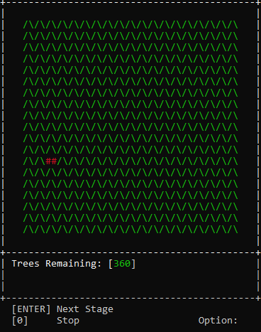

 

<h2>
  Screenshots
</h2>

<table align="center">
<tr>
    <td>Turn 1</td>
    <td>Turn 30</td>
    <td>Turn 60</td>
    <td>Turn 90</td>
    <td>Turn 112</td>
  </tr>
  <tr>
    <td>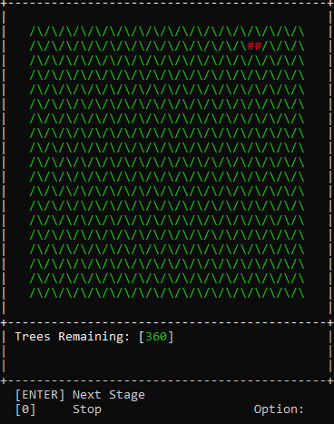</td>
    <td>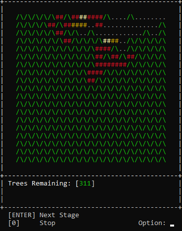</td>
    <td>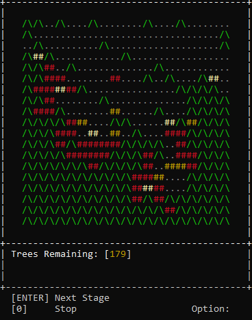</td>
    <td>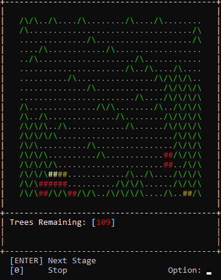</td>
    <td>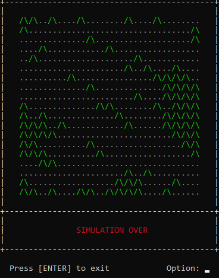</td>
  </tr>
</table>

 

In the above screenshots, a full forest density has been used and a random location has been selected for the fire to begin. Starting with 360 trees, several turns into the simulation only 311 tree cells are remaining, and several turns further this is reduced to 179, which is below 50% of the total tree cells so the counter changes to amber. Over more turns, the fire rapidly rips through the forest, leaving dead trees in its wake and a red warning for less than 25% of the total tree cells remaining. Once the fire dies out, the simulation ends.

 

<table align="center">
  <tr>
    <td>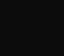</td>
    <td>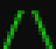</td>
    <td>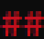</td>
    <td>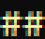</td>
    <td>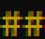</td>
    <td>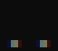</td>
  </tr>
  <tr>
    <td>Empty</td>
    <td>Tree</td>
    <td>Burning Tree</td>
    <td>Hot Embers</td>
    <td>Embers</td>
    <td>Dead Tree</td>
  </tr>
</table>

 

This table shows the different cells used in the simulation. If the forest density is set to the maximum, then there won't be any empty cells. Beginning with the tree cell and moving right through the table shows the cell stages that a tree will go through if it happens to catch on fire. The burning tree, hot embers, and embers cells are indicated with a hash with variation in colour to indicate the intensity of the fire. A dead tree cell remains after the fire has finished burning.
